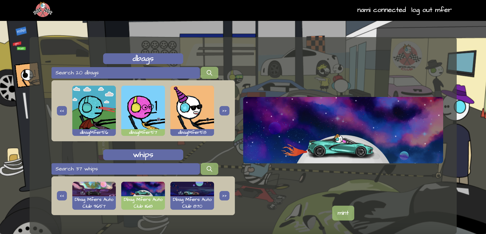

# DbagsVroom

This project allowed an NFT project in the Cardano ecosystem combine two assets from different policyIDs into a unique NFT. Utilizing the dbagMfers collection and their respected Dbag Mfer Auto Club we were able to allow owners select a dbagMfer nft and a Auto Club nft which then combined into a unique NFT. Users were able to then purchase and mint that custom NFT into their crypto wallet. 

# Technologies Used
- TypeScript
- React
- Lucid-Cardano
- Node
- Express
- Blockfrost

# Running the files 
1. ``` npm install ```
2. Fill in .env in server/.env
    BLOCKFROST_PREPROD=
    DBAGS_GUILD_ID=
    CLIENT_ID =
    CLIENT_SECRET =
    # NODE_ENV=production
    PINATA_API_KEY=
    PINATA_API_SECRET=
    PINATA_JWT=
    POLICY_ID=
    POLICY_SIGNING_CBOR=
    REDIRECT_URI =
    SECRET=
    WALLET_PRIVATE_KEY=

3. ``` npm run develop ```

# Sample


